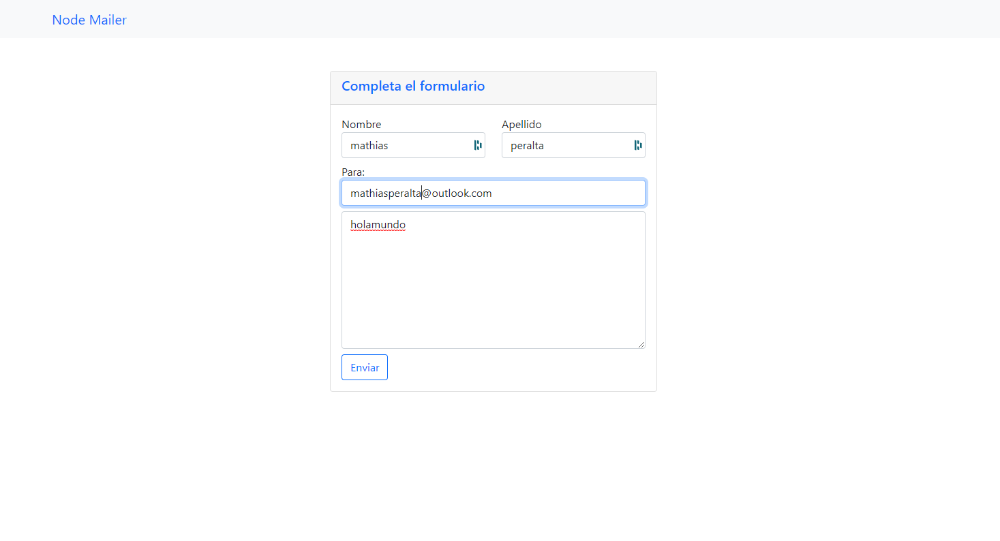

<!DOCTYPE html>
    <html lang="en">
    <head>
        <meta charset="UTF-8">
        <meta name="viewport" content="width=device-width, initial-scale=1.0">
    </head>
    <body>
        
Ejemplo sencillo de envio de correos a través de un formulario

        
Si descagas el código solo debes poner tu correo y contraseña en la carpeta indexController!

        
Obs: si tu correo cuenta con 2FA no va a funcionar..

        
    </body>
</html>